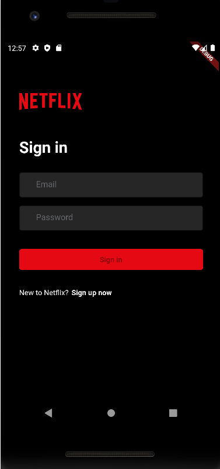

# netflix_clone_fiap



Project was created to study Flutter development.
The project was builded following Clean Code Architecture, also using GetX library to deal with routes, lifecycle and depdendency injection.

## Team

- Leonardo Andrade - 341494
- Matheus Tadeu - 340506

## How to start project

_1 - Clean project_

```bash
flutter clean
```

_2 - Donwload project dependecies_

```bash
flutter pub get
```

_3 - Run project_

```bash
flutter start
```
